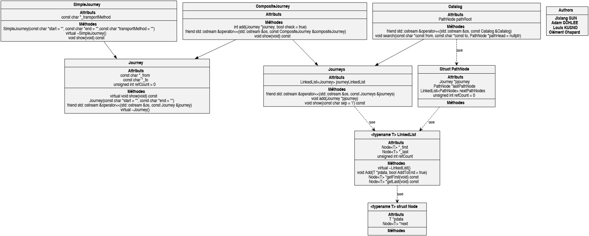

# CATALOG

## This is a clone of [this repo](https://github.com/Snownamida/Cpp-TP2)

## Authors:  SUN Jixiang - SCHLEE Adam - KUSNO Louis - CHAPARD Clément

## To launch the app

```console
make
./trajets
```
*The executable is called `trajets`*

## Heritage graph


